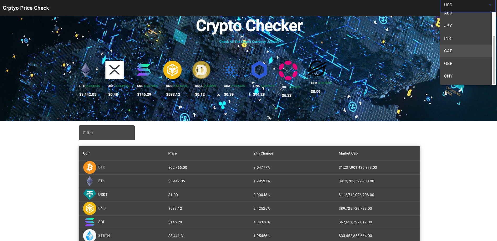

### Credit 
This project is a practice project following the video tutorial guide 'Angular Project - Cryptocurrency price tracker | Angular HTTP Client | Angular Material UI' provided by Let's Program Channel.

YT Link: https://www.youtube.com/watch?v=vb6b67HiuC8

Github: https://github.com/yshashi/crypto-checker-yt

This Project utilizes coin gecko API.

#### Preview

#### Changes added
Added more currency in the dropdown menu.
Made the values in coin-detail page more dynamic to accomodate other currencies.